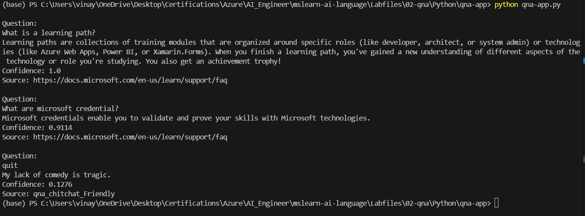

# Question Answering Using Azure
## Project Overview
This project is designed to answer questions based on a predefined knowledge base or FAQ using Azure Cognitive Services. The model can determine the most relevant answer to a given question, providing both the answer and the confidence level of the response.

## Features

- **Question Understanding:** The model interprets the input question.
- **Answer Retrieval:** The system searches through the knowledge base to find the most relevant answer.
- **Confidence Scoring:** Each answer is provided with a confidence score, indicating the model’s certainty.
- **Source Identification:** The source of the answer is identified, which could be a specific document, web link, or knowledge base.

## Technologies Used
- **Programming Language:** Python
- **Development Environment:** Visual Studio Code
- **Cloud Service:** Azure Cognitive Services

## Setup and Execution

- Clone the repository
- Install the required packages
- Set up Azure credentials
  - **a.** Create an Azure Cognitive Services account if you don’t have one.
  - **b.** Obtain your API key and endpoint from the Azure portal.
  - **c.** Configure the script by replacing the placeholder variables in `text_analysis.py` with your Azure API key and endpoint.
- Run the Script

## Sample Output
- **Question:** What is a learning path?
  - **Answer:** Learning paths are collections of training modules that are organized around specific roles...
  - **Confidence:** 1.0
  - **Source:** Microsoft Learning Path FAQ

- **Question:** What are Microsoft credentials?
  - **Answer:** Microsoft credentials enable you to validate and prove your skills with Microsoft technologies.
  - **Confidence:** 0.9114
  - **Source:** Microsoft Credential FAQ
 
  

  ## How It Works

- **Question Input:** The user provides a question as input.
- **API Call:** The question is sent to Azure’s QnA Maker or Language Understanding API.
- **Answer Processing:** The API processes the question and retrieves the most relevant answer along with a confidence score.
- **Output Display:** The results are displayed in the terminal or can be saved in a JSON file for further analysis.

