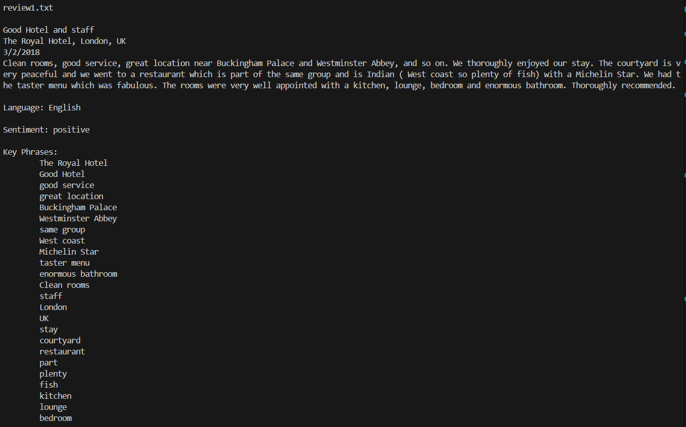
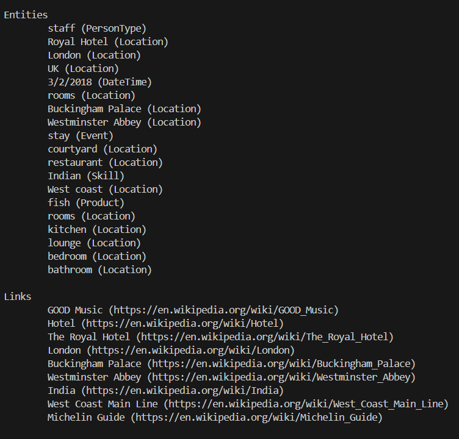

# Text Analysis using Azure
## Project Overview
This project is designed to perform comprehensive text analysis on a set of reviews. By leveraging Azure Cognitive Services within Visual Studio Code, the project extracts valuable insights from the text, including language detection, sentiment analysis, extract key phrases, named entities, and linked entities.

## Features

- **Language Detection:** Identifies the language of each review.
- **Sentiment Analysis:** Analyzes the sentiment of the text, categorizing it as positive, negative, or neutral.
- **Key Phrase Extraction:** Extracts the most significant phrases from the text.
- **Named Entity Recognition:** Identifies and categorizes named entities such as people, organizations, and locations.
- **Linked Entities:** Detects and links entities to relevant Wikipedia pages.

## Sample Output
### Input Review 
Good Hotel and staff
The Royal Hotel, London, UK
3/2/2018
Clean rooms, good service, great location near Buckingham Palace and Westminster Abbey, and so on. We thoroughly enjoyed our stay. The courtyard is very peaceful and we went to a restaurant which is part of the same group and is Indian ( West coast so plenty of fish) with a Michelin Star. We had the taster menu which was fabulous. The rooms were very well appointed with a kitchen, lounge, bedroom and enormous bathroom. Thoroughly recommended.

### Analysis Results

- **Language:** English
- **Sentiment:** Positive
- **Key Phrases:** 
  - 'The Royal Hotel'
  - 'Good Hotel'
  - 'good service'
  - 'great location'
  - 'Buckingham Palace'
  - 'Westminster Abbey', etc.
- **Entities:**
  - staff (PersonType)
  - Royal Hotel (Location)
  - London (Location)
- **Linked Entities:**
  - GOOD Music : https://en.wikipedia.org/wiki/GOOD_Music
  - Hotel : https://en.wikipedia.org/wiki/Hotel

## How It Works
The project leverages Azure Cognitive Services to analyze the textual data. Here’s a brief overview of the steps:

- **Text Input:** The reviews are inputted as plain text.
- **API Calls:** The text is sent to Azure’s Text Analytics API.
- **Data Processing:** The API processes the text and returns results for language detection, sentiment analysis, key phrase extraction, entity recognition, and linked entities.
- **Output Display:** The results are printed in the terminal or saved in a JSON file for further analysis.

